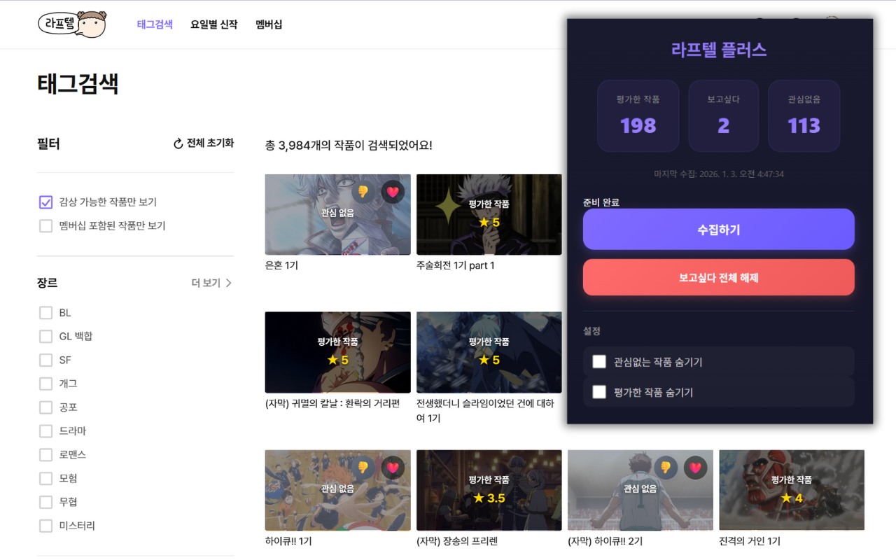

# 라프텔 플러스

<p align="center">
  
</p>

<p align="center">
  <strong>라프텔 애니메이션 스트리밍 서비스를 더 편리하게</strong><br>
  평가한 작품, 보고싶다, 관심없음 상태를 한눈에 확인하고 관리하세요.
</p>

<p align="center">
  
  
  
  
</p>

<p align="center">
  <a href="#-주요-기능">주요 기능</a> •
  <a href="#-설치-방법">설치</a> •
  <a href="#-사용-방법">사용법</a> •
  <a href="#-개발">개발</a>
</p>

---

## ✨ 주요 기능

### 🎯 작품 상태 시각화

| 상태 | 표시 방식 |
|------|----------|
| ⭐ 평가한 작품 | 별점과 함께 오버레이로 표시 |
| 💖 보고싶다 | 분홍색 하이라이트로 표시 |
| 👎 관심없음 | 어둡게 표시하여 구분 |

### 🚀 빠른 액션 버튼

작품 카드에 마우스를 올리면 보고싶다/관심없음 버튼이 나타나며, 클릭 한 번으로 상태를 변경할 수 있습니다.

### 📋 관심없음 관리

라프텔에서 제공하지 않는 관심없음 목록을 확장 프로그램에서 관리합니다.

- 🔍 목록 검색
- 📊 장르/연령등급 표시
- ❌ 개별 해제

### ⚙️ 설정 옵션

- [x] 관심없는 작품 숨기기 (기본 ON)
- [ ] 평가한 작품 숨기기

### 🔄 동기화

- 플로팅 버튼으로 언제든 최신 상태 동기화
- 평가 변경 시 자동 증분 동기화

---

## 📦 설치 방법

### Chrome 웹 스토어

> 🚧 출시 예정

### 수동 설치

1. [Releases](../../releases)에서 최신 버전 다운로드
2. 압축 해제
3. Chrome에서 `chrome://extensions/` 열기
4. **개발자 모드** 활성화
5. **압축해제된 확장 프로그램을 로드합니다** 클릭 후 폴더 선택

---

## 🎮 사용 방법

```
1️⃣  확장 프로그램 설치 후 라프텔에 로그인
2️⃣  툴바의 확장 프로그램 아이콘 클릭
3️⃣  "수집하기" 버튼을 클릭하여 초기 데이터 수집
4️⃣  라프텔 사이트에서 작품 상태가 자동으로 표시됩니다
```

---

## 🛠 개발

### 요구사항

- Node.js 18+

### 설치 및 빌드

```bash
# 의존성 설치
npm install

# 빌드 (dist/laftel-plus-{version}.zip 생성)
npm run build

# 정리
npm run clean
```

### 개발 모드

1. `chrome://extensions/` 열기
2. 개발자 모드 활성화
3. 압축해제된 확장 프로그램을 로드합니다 → 프로젝트 폴더 선택
4. 코드 수정 후 확장 프로그램 새로고침

---

## 🔒 권한 안내

| 권한 | 용도 |
|-----|------|
| `storage` | 평가/보고싶다/관심없음 데이터 저장 |
| `cookies` | 라프텔 로그인 상태 확인 |
| `host_permissions` | laftel.net 도메인에서만 동작 |

> 💡 모든 데이터는 브라우저 로컬 스토리지에만 저장되며, 외부 서버로 전송되지 않습니다.

---

## 📄 라이선스

MIT License

---

<p align="center">
  <sub>이 확장 프로그램은 라프텔 공식 서비스가 아닙니다.</sub>
</p>
